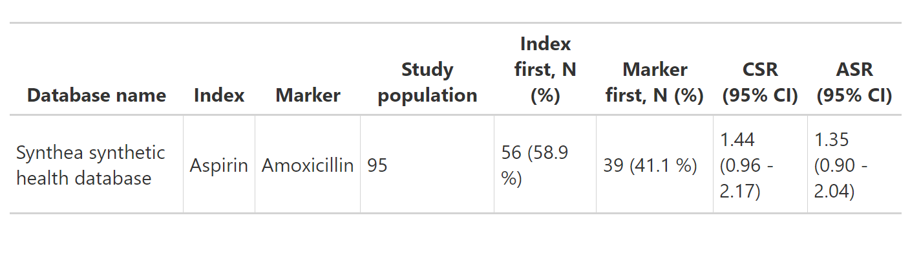
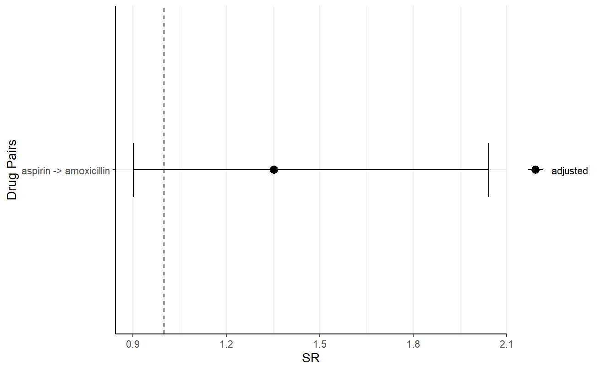
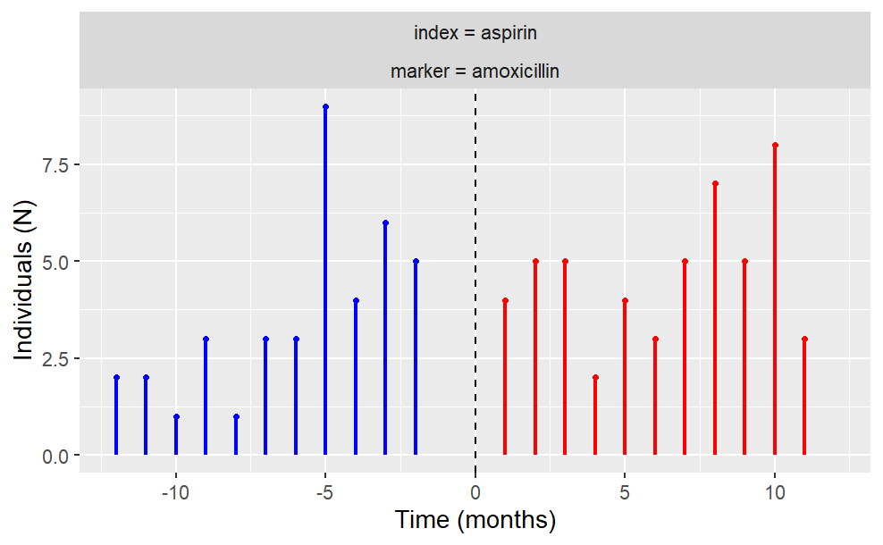

<!-- README.md is generated from README.Rmd. Please edit that file -->

# CohortSymmetry <a href="https://ohdsi.github.io/CohortSymmetry/"></a>

<!-- badges: start -->

[](https://lifecycle.r-lib.org/articles/stages.html#stable)
[](https://CRAN.R-project.org/package=CohortSymmetry)
[](https://app.codecov.io/gh/OHDSI/CohortSymmetry)
[](https://github.com/OHDSI/CohortSymmetry/actions/workflows/R-CMD-check.yaml)
<!-- badges: end -->

The goal of CohortSymmetry is to carry out the necessary calculations
for Sequence Symmetry Analysis (SSA). It is highly recommended that this
method is tested beforehand against well-known positive and negative
controls. Such controls could be found using [Pratt et al
(2015)](https://pubmed.ncbi.nlm.nih.gov/25907076/).

## Installation

You can install the development version of CohortSymmetry from
[GitHub](https://github.com/) with:

``` r
# install.packages("pak")
pak::pak("OHDSI/CohortSymmetry")
```

## Example

### Create a reference to data in the OMOP CDM format

The CohortSymmetry package is designed to work with data in the OMOP CDM
(Common Data Model) format, so our first step is to create a reference
to the data using the `CDMConnector` package.

As an example, we will be using Eunomia data set.

``` r
library(CDMConnector)
library(dplyr)
library(DBI)
library(duckdb)
 
db <- DBI::dbConnect(duckdb::duckdb(), 
                     dbdir = CDMConnector::eunomiaDir())
cdm <- cdmFromCon(
  con = db,
  cdmSchema = "main",
  writeSchema = "main"
)
```

### Step 0: Instantiate two cohorts in the cdm reference

This will be entirely user’s choice on how to generate such cohorts.
Minimally, this package requires two cohort tables in the cdm reference,
namely the index_cohort and the marker_cohort.

If one wants to generate two drugs cohorts in cdm, the [DrugUtilisation
R package](https://darwin-eu.github.io/DrugUtilisation/) is recommended.
For merely illustration purposes, we will carry out SSA on aspirin
(index_cohort) against amoxicillin (marker_cohort). Multiple markers can
be instantiated in the marker cohort and each one will be tested against
the index cohort.

``` r
library(dplyr)
library(DrugUtilisation)
cdm <- DrugUtilisation::generateIngredientCohortSet(
  cdm = cdm, 
  name = "aspirin",
  ingredient = "aspirin")
#> ℹ Subsetting drug_exposure table
#> ℹ Checking whether any record needs to be dropped.
#> ℹ Collapsing overlaping records.
#> ℹ Collapsing records with gapEra = 1 days.

cdm <- DrugUtilisation::generateIngredientCohortSet(
  cdm = cdm,
  name = "amoxicillin",
  ingredient = "amoxicillin")
#> ℹ Subsetting drug_exposure table
#> ℹ Checking whether any record needs to be dropped.
#> ℹ Collapsing overlaping records.
#> ℹ Collapsing records with gapEra = 1 days.
```

### Step 1: generateSequenceCohortSet

In order to initiate the calculations, the two cohorts tables need to be
intersected using `generateSequenceCohortSet()`. This process will
output all the individuals who appeared on both tables according to a
user-specified parameters. This includes `timeGap`, `washoutWindow`,
`indexMarkerGap` and `daysPriorObservation`. Details on these parameters
are found on the vignette.

``` r
library(CohortSymmetry)
 
cdm <- generateSequenceCohortSet(
  cdm = cdm,
  indexTable = "aspirin",
  markerTable = "amoxicillin",
  name = "aspirin_amoxicillin"
)

cdm$aspirin_amoxicillin %>% 
  dplyr::glimpse()
#> Rows: ??
#> Columns: 6
#> $ cohort_definition_id <int> 1, 1, 1, 1, 1, 1, 1, 1, 1, 1, 1, 1, 1, 1, 1, 1, 1…
#> $ subject_id           <int> 144, 363, 1813, 2621, 3436, 4867, 331, 1611, 1785…
#> $ cohort_start_date    <date> 1978-10-30, 1965-06-09, 1984-04-05, 1964-05-14, …
#> $ cohort_end_date      <date> 1979-09-04, 1965-08-01, 1984-09-23, 1964-10-12, …
#> $ index_date           <date> 1978-10-30, 1965-08-01, 1984-09-23, 1964-10-12, …
#> $ marker_date          <date> 1979-09-04, 1965-06-09, 1984-04-05, 1964-05-14, …
```

### Step 2: summariseSequenceRatios

To get the sequence ratios, we would need the output of the
generateSequenceCohortSet() function to be fed into
`summariseSequenceRatios()` The output of this process contains
cSR(crude sequence ratio), aSR(adjusted sequence ratio) and confidence
intervals.

``` r
res <- summariseSequenceRatios(cohort = cdm$aspirin_amoxicillin)
 
res %>% glimpse()
#> Rows: 10
#> Columns: 13
#> $ result_id        <int> 1, 1, 1, 1, 1, 1, 1, 1, 1, 1
#> $ cdm_name         <chr> "Synthea", "Synthea", "Synthea", "Synthea", "Synthea"…
#> $ group_name       <chr> "index_cohort_name &&& marker_cohort_name", "index_co…
#> $ group_level      <chr> "aspirin &&& amoxicillin", "aspirin &&& amoxicillin",…
#> $ strata_name      <chr> "overall", "overall", "overall", "overall", "overall"…
#> $ strata_level     <chr> "overall", "overall", "overall", "overall", "overall"…
#> $ variable_name    <chr> "index", "index", "marker", "marker", "crude", "adjus…
#> $ variable_level   <chr> "first_pharmac", "first_pharmac", "first_pharmac", "f…
#> $ estimate_name    <chr> "count", "percentage", "count", "percentage", "point_…
#> $ estimate_type    <chr> "integer", "numeric", "integer", "numeric", "numeric"…
#> $ estimate_value   <chr> "56", "58.9", "39", "41.1", "1.43589743589744", "1.35…
#> $ additional_name  <chr> "overall", "overall", "overall", "overall", "overall"…
#> $ additional_level <chr> "overall", "overall", "overall", "overall", "overall"…
```

### Step 3: visualise the results

The user could then visualise their results using a wide array of
provided tools.

For example, the following produces a flextable table.

``` r
flex_results <- tableSequenceRatios(result = res)

flex_results
```

 Note that gt is also an option,
users may specify this by using the `type` argument.

One could also visualise the plot, for example, the following is the
plot of the adjusted sequence ratio.

``` r
plotSequenceRatios(result = res,
                  onlyASR = T,
                  colours = "black")
```



The user also has the freedom to plot temporal trend like so:

``` r
plotTemporalSymmetry(cdm = cdm, sequenceTable = "aspirin_amoxicillin")
```



### Disconnect from the cdm database connection

``` r
CDMConnector::cdmDisconnect(cdm = cdm)
```
