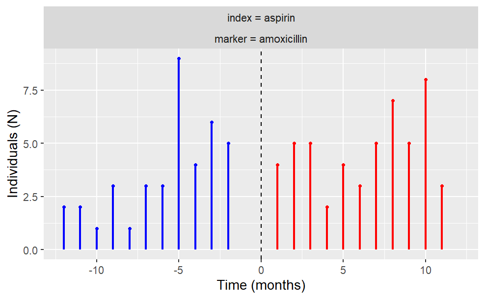

<!-- README.md is generated from README.Rmd. Please edit that file -->

# CohortSymmetry 

<!-- badges: start -->
<!-- badges: end -->

The goal of CohortSymmetry is to carry out the necessary calculations
for Sequence Symmetry Analysis (SSA). It is highly recommended that this
method is tested beforehand against well-known positive and negative
controls. Such controls could be found using the paper in the Reference.
<sup>1</sup>

## Installation

You can install the development version of CohortSymmetry from
[GitHub](https://github.com/) with:

``` r
# install.packages("devtools")
devtools::install_github("oxford-pharmacoepi/CohortSymmetry")
```

## Example

### Create a reference to data in the OMOP CDM format

The CohortSymmetry package is designed to work with data in the OMOP CDM
(Common Data Model) format, so our first step is to create a reference
to the data using the `CDMConnector` package.

As an example, we will be using Eunomia data set.

``` r
library(CDMConnector)
library(dplyr)
library(DBI)
library(duckdb)
 
db <- DBI::dbConnect(duckdb::duckdb(), 
                     dbdir = CDMConnector::eunomia_dir())
cdm <- cdm_from_con(
  con = db,
  cdm_schema = "main",
  write_schema = "main"
)
```

### Step 0: Instantiate two cohorts in the cdm reference

This will be entirely user’s choice on how to generate such cohorts.
Minimally, this package requires two cohort tables in the cdm reference,
namely the index_cohort and the marker_cohort.

If one wants to generate two drugs cohorts in cdm, DrugUtilisation is
recommended. For merely illustration purposes, we will carry out PSSA on
aspirin (index_cohort) against amoxicillin (marker_cohort)

``` r
library(dplyr)
library(DrugUtilisation)
cdm <- DrugUtilisation::generateIngredientCohortSet(
  cdm = cdm, 
  name = "aspirin",
  ingredient = "aspirin")

cdm <- DrugUtilisation::generateIngredientCohortSet(
  cdm = cdm,
  name = "amoxicillin",
  ingredient = "amoxicillin")
```

### Step 1: generateSequenceCohortSet

In order to initiate the calculations, the two cohorts tables need to be
intersected using `generateSequenceCohortSet()`. This process will
output all the individuals who appeared on both tables according to a
user-specified parameters. This includes `timeGap`, `washoutWindow`,
`indexMarkerGap` and `daysPriorObservation`. Details on these parameters
could be found on the vignette.

``` r
library(CohortSymmetry)
 
cdm <- generateSequenceCohortSet(
  cdm = cdm,
  indexTable = "aspirin",
  markerTable = "amoxicillin",
  name = "aspirin_amoxicillin"
)

cdm$aspirin_amoxicillin %>% 
  dplyr::glimpse()
#> Rows: ??
#> Columns: 6
#> Database: DuckDB v0.10.1 [xihangc@Windows 10 x64:R 4.3.1/C:\Users\xihangc\AppData\Local\Temp\Rtmpw17gQW\file5b4834af5ab1.duckdb]
#> $ cohort_definition_id <int> 1, 1, 1, 1, 1, 1, 1, 1, 1, 1, 1, 1, 1, 1, 1, 1, 1…
#> $ subject_id           <int> 65, 119, 185, 144, 235, 197, 310, 280, 316, 331, …
#> $ cohort_start_date    <date> 1968-07-29, 1967-05-28, 1947-04-07, 1978-10-30, …
#> $ cohort_end_date      <date> 1969-06-18, 1968-04-07, 1947-04-12, 1979-09-04, …
#> $ index_date           <date> 1969-06-18, 1967-05-28, 1947-04-07, 1978-10-30, …
#> $ marker_date          <date> 1968-07-29, 1968-04-07, 1947-04-12, 1979-09-04, …
```

### Step 2: summariseSequenceRatio

To get the sequence ratios, we would need the output of the
generateSequenceCohortSet() function to be fed into
`summariseSequenceRatio()` The output of this process contains cSR(crude
sequence ratio), aSR(adjusted sequence ratio) and confidence intervals.

``` r
res <- summariseSequenceRatio(cohort = cdm$aspirin_amoxicillin)
#> Joining with `by = join_by(days_prior_observation, washout_window,
#> index_marker_gap, combination_window, confidence_interval,
#> moving_average_restriction, cdm_name)`
#> ! The following column type were changed: • result_id: from character to
#> integer
 
res %>% glimpse()
#> Rows: 10
#> Columns: 13
#> $ result_id        <int> 1, 1, 1, 1, 1, 1, 1, 1, 1, 1
#> $ cdm_name         <chr> "Synthea synthetic health database", "Synthea synthet…
#> $ group_name       <chr> "index_cohort_name &&& marker_cohort_name", "index_co…
#> $ group_level      <chr> "aspirin &&& amoxicillin", "aspirin &&& amoxicillin",…
#> $ strata_name      <chr> "overall", "overall", "overall", "overall", "overall"…
#> $ strata_level     <chr> "overall", "overall", "overall", "overall", "overall"…
#> $ variable_name    <chr> "index", "index", "marker", "marker", "crude", "adjus…
#> $ variable_level   <chr> "first_pharmac", "first_pharmac", "first_pharmac", "f…
#> $ estimate_name    <chr> "count", "percentage", "count", "percentage", "point_…
#> $ estimate_type    <chr> "integer", "numeric", "integer", "numeric", "numeric"…
#> $ estimate_value   <chr> "56", "58.9", "39", "41.1", "1.43589743589744", "1.35…
#> $ additional_name  <chr> "overall", "overall", "overall", "overall", "overall"…
#> $ additional_level <chr> "overall", "overall", "overall", "overall", "overall"…
```

### Step 3: visualise the results

The user could then visualise their results using a wide array of
provided tools.

For example, the following produces a gt table.

``` r
gt_results <- tableSequenceRatios(result = res)

gt_results
```

 Note that flextable is also an
option, users may specify this by using the `type` argument.

One could also visualise the plot, for example, the following is the
plot of the adjusted sequence ratio.

``` r
plotSequenceRatio(result = res,
                  onlyaSR = T,
                  colours = "black")
```


The user also has the freedom to plot temporal trend like so:

``` r
plotTemporalSymmetry(cdm = cdm, sequenceTable = "aspirin_amoxicillin")
```



### Disconnect from the cdm database connection

``` r
CDMConnector::cdmDisconnect(cdm = cdm)
```

## References

1.  Pratt N, Chan EW, Choi NK, et al. Prescription sequence symmetry
    analysis: assessing risk, temporality, and consistency for adverse
    drug reactions across datasets in five countries. Pharmacoepidemiol
    Drug Saf. 2015;24(8):858-864.
