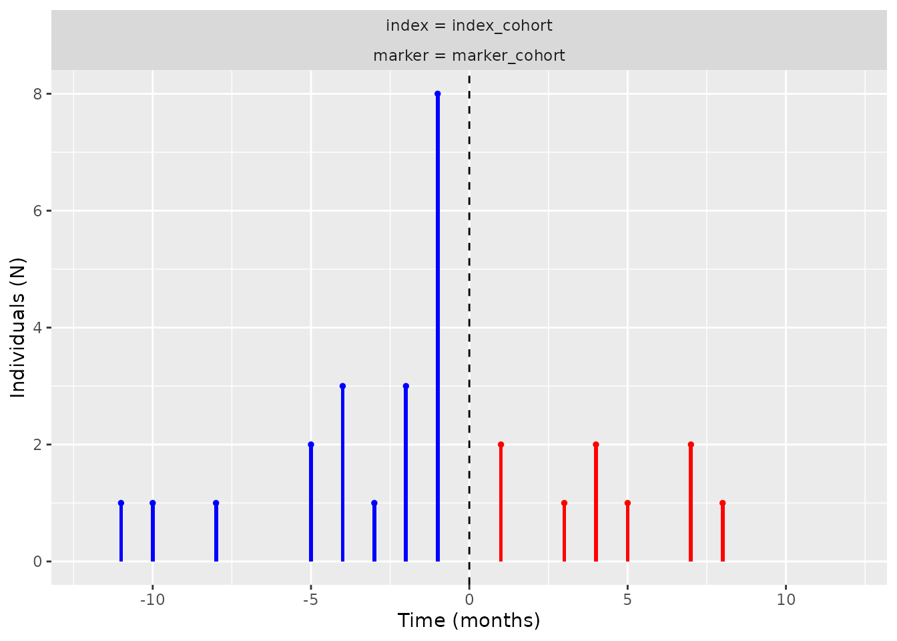
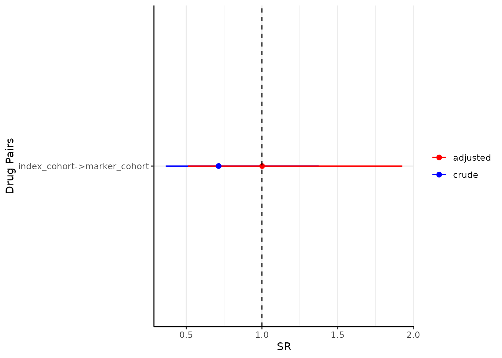
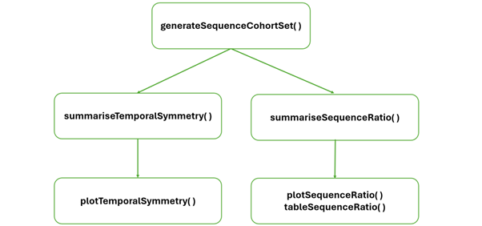

# Introduction to CohortSymmetry

CohortSymmetry provides tools to perform Sequence Symmetry Analysis
(SSA). Before using the package, it is highly recommended that this
method is tested beforehand against well-known positive and negative
controls. The details of SSA and the relevant controls could be found
using Pratt et al (2015).

The functions you will interact with are:

1.  [`generateSequenceCohortSet()`](https://ohdsi.github.io/CohortSymmetry/reference/generateSequenceCohortSet.md):
    this function will create a cohort with individuals present in both
    (the index and the marker) cohorts.

2.  [`summariseSequenceRatios()`](https://ohdsi.github.io/CohortSymmetry/reference/summariseSequenceRatios.md):
    this function will calculate sequence ratios.

3.  [`tableSequenceRatios()`](https://ohdsi.github.io/CohortSymmetry/reference/tableSequenceRatios.md)
    and
    [`plotSequenceRatios()`](https://ohdsi.github.io/CohortSymmetry/reference/plotSequenceRatios.md):
    these functions will help us to visualise the sequence ratio
    results.

4.  [`summariseTemporalSymmetry()`](https://ohdsi.github.io/CohortSymmetry/reference/summariseTemporalSymmetry.md):
    this function will produce aggregated results based on the time
    difference between two cohort start dates.

5.  [`plotTemporalSymmetry()`](https://ohdsi.github.io/CohortSymmetry/reference/plotTemporalSymmetry.md):
    this function will help us to visualise the results from
    summariseTemporalSymmetry().

Below, you will find an example analysis that offers a brief and
comprehensive overview of the package’s functionalities. More context
and further examples for each of these functions are provided in later
vignettes.

First, let’s load the relevant libraries.

``` r

library(CDMConnector)
library(dplyr)
library(DBI)
library(omock)
library(CohortSymmetry)
library(duckdb)
```

The CohortSymmetry package works with data mapped to the OMOP CDM.
Hence, the initial step involves connecting to a database. As an
example, we will be using Omock package to generate a mock database with
two mock cohorts: the **index_cohort** and the **marker_cohort**.

``` r

cdm <- emptyCdmReference(cdmName = "mock") |>
  mockPerson(nPerson = 100) |>
  mockObservationPeriod() |>
  mockCohort(
    name = "index_cohort",
    numberCohorts = 1,
    cohortName = c("index_cohort"),
    seed = 1,
  ) |>
  mockCohort(
    name = "marker_cohort",
    numberCohorts = 1,
    cohortName = c("marker_cohort"), 
    seed = 2
  )

con <- dbConnect(duckdb::duckdb())
cdm <- copyCdmTo(con = con, cdm = cdm, schema = "main", overwrite = T)
```

Once we have established a connection to the database, we can use the
[`generateSequenceCohortSet()`](https://ohdsi.github.io/CohortSymmetry/reference/generateSequenceCohortSet.md)
function to find the intersection of the two cohorts. This function will
provide us with the individuals who appear in both cohorts, which will
be named **intersect** - another cohort in the cdm reference.

``` r

cdm <- generateSequenceCohortSet(
  cdm = cdm,
  indexTable = "index_cohort",
  markerTable = "marker_cohort",
  name = "intersect",
  combinationWindow = c(0, Inf)
)
```

See below that the generated cohort follows the format of an OMOP CDM
cohort with the addition of two extra columns: *index_date* and
*marker_date*. These columns correspond to the *cohort_start_date* in
the **index_cohort** and the **marker_cohort**, respectively.

``` r

cdm$intersect |> 
  dplyr::glimpse()
#> Rows: ??
#> Columns: 6
#> $ cohort_definition_id <int> 1, 1, 1, 1, 1, 1, 1, 1, 1, 1, 1, 1, 1, 1, 1, 1, 1…
#> $ subject_id           <int> 13, 53, 26, 21, 25, 20, 68, 17, 44, 65, 75, 79, 1…
#> $ cohort_start_date    <date> 1990-02-22, 1993-03-06, 2007-01-05, 2008-04-30, …
#> $ cohort_end_date      <date> 1994-11-09, 2000-05-15, 2007-05-03, 2010-01-25, …
#> $ index_date           <date> 1994-11-09, 1993-03-06, 2007-01-05, 2010-01-25, …
#> $ marker_date          <date> 1990-02-22, 2000-05-15, 2007-05-03, 2008-04-30, …
```

Once we have the intersect cohort, you are able to explore the temporal
symmetry by using `summariseTemporalSymmetry`, `tableTemporalSymmetry`,
and
[`plotTemporalSymmetry()`](https://ohdsi.github.io/CohortSymmetry/reference/plotTemporalSymmetry.md):

``` r

temporal_symmetry <- summariseTemporalSymmetry(
  cohort = cdm$intersect, 
  timescale = "year")
```

The result can be viewed using table and plot functions.

``` r

tableTemporalSymmetry(result = temporal_symmetry)
```

``` r

plotTemporalSymmetry(result = temporal_symmetry)
```



Next, we will use the
[`summariseSequenceRatios()`](https://ohdsi.github.io/CohortSymmetry/reference/summariseSequenceRatios.md)
function to get the crude sequence ratios, adjusted sequence ratios, and
the corresponding confidence intervals.

``` r

sequence_ratio <- summariseSequenceRatios(cohort = cdm$intersect)
```

Finally, we can visualise the results using
[`tableSequenceRatios()`](https://ohdsi.github.io/CohortSymmetry/reference/tableSequenceRatios.md):

``` r

tableSequenceRatios(result = sequence_ratio)
```

Or create a plot with the adjusted sequence ratios:

``` r

plotSequenceRatios(result = sequence_ratio)
```



## As a diagram

Diagrammatically, the work flow using CohortSymmetry resembles the
following flow chat:


