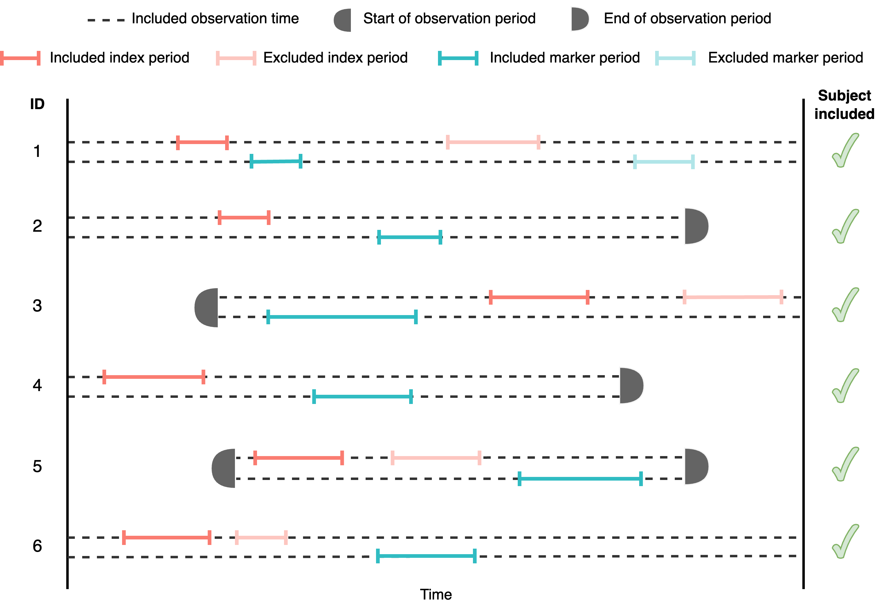
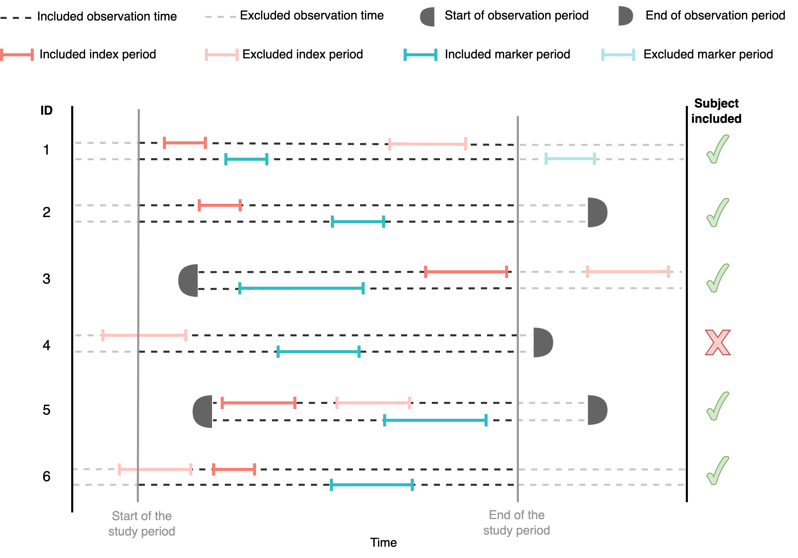
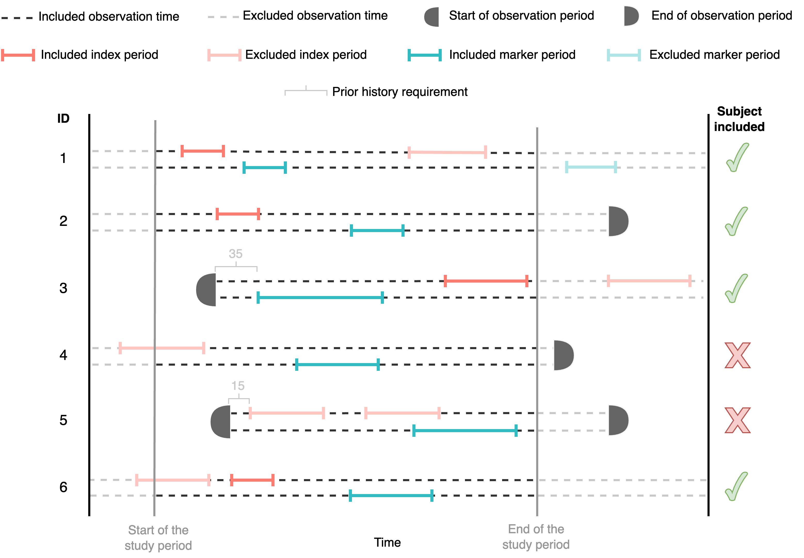
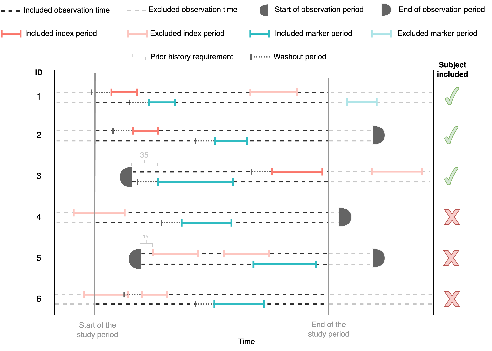
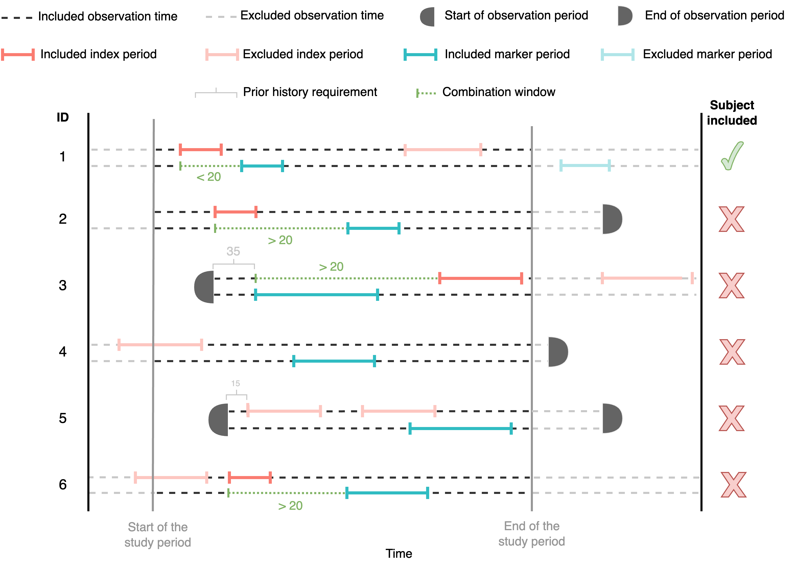
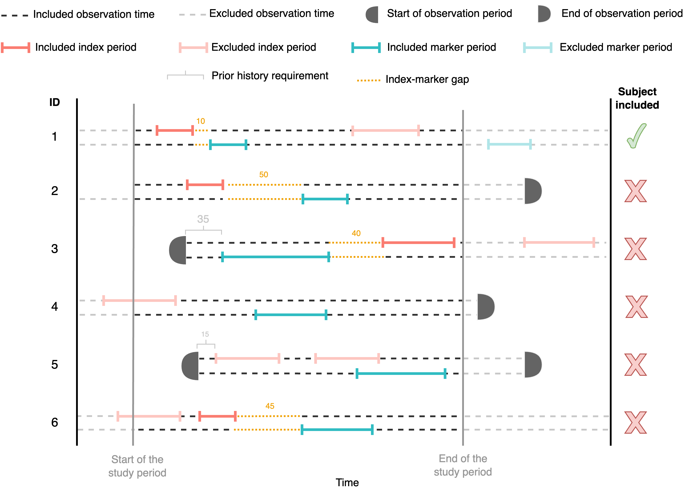

# Step 1. Generate a sequence cohort

## Introduction

In this vignette we will explore the functionalities of
`generateSequenceCohort()`.

### Create a cdm object

CohortSymmetry package is designed to work with data mapped to OMOP, so
the first step is to create a reference to the data using the
CDMConnector package. We will use the Eunomia dataset for the subsequent
examples.

``` r

library(CDMConnector)
library(dplyr)
library(DBI)
library(CohortSymmetry)
library(duckdb)

db <- DBI::dbConnect(duckdb::duckdb(), 
                     dbdir = CDMConnector::eunomiaDir())
cdm <- cdmFromCon(
  con = db,
  cdmSchema = "main",
  writeSchema = "main"
)
```

### Instantiate two cohorts in the cdm reference

CohortSymmetry package requires that the cdm object contains two cohort
tables: the index cohort and the marker cohort. There are a lot of
different ways to create these cohorts, and it will depend on what the
index cohort and marker cohort represent. Here, we use the
DrugUtilisation package to generate two drug cohorts in the cdm object.
For illustrative purposes, we will carry out SSA on aspirin
(index_cohort) against acetaminophen (marker_cohort).

``` r

library(DrugUtilisation)
cdm <- DrugUtilisation::generateIngredientCohortSet(
  cdm = cdm,
  name = "aspirin",
  ingredient = "aspirin")

cdm <- DrugUtilisation::generateIngredientCohortSet(
  cdm = cdm,
  name = "acetaminophen",
  ingredient = "acetaminophen")
```

## Generate a sequence cohort

In order to initiate the calculations, the two cohorts tables need to be
intersected using
[`generateSequenceCohortSet()`](https://ohdsi.github.io/CohortSymmetry/reference/generateSequenceCohortSet.md).
This process will output all the individuals who appear on both tables
subject to different parameters. Each parameter corresponds to a
specific requirement. The parameters for this function include
`cohortDateRange`, `daysPriorObservation`, `washoutWindow`,
`indexMarkerGap` and `combinationWindow`. Let’s go through examples to
see how each parameter works.

### No specific requirements

Let’s study the simplest case where no requirements are imposed. See
figure below to see an example of an analysis containing six different
participants.



See that only the first event/episode (for both the index and the
marker) is included in the analysis. As there is no restriction criteria
and all the individuals have an episode in the index and the marker
cohort, all the subjects are included in the analysis. We can get a
sequence cohort without including any particular requirement like so:

``` r

cdm <- generateSequenceCohortSet(
  cdm = cdm,
  indexTable = "aspirin",
  markerTable = "acetaminophen",
  name = "intersect",
  cohortDateRange = as.Date(c(NA, NA)), #default
  daysPriorObservation = 0, #default
  washoutWindow = 0, #default
  indexMarkerGap = Inf, #default
  combinationWindow = c(0,Inf)) # default

cdm$intersect |> 
  dplyr::glimpse()
#> Rows: ??
#> Columns: 6
#> $ cohort_definition_id <int> 1, 1, 1, 1, 1, 1, 1, 1, 1, 1, 1, 1, 1, 1, 1, 1, 1…
#> $ subject_id           <int> 61, 66, 102, 140, 149, 153, 318, 340, 369, 412, 5…
#> $ cohort_start_date    <date> 1968-08-18, 1959-04-23, 1974-01-16, 1970-05-31, …
#> $ cohort_end_date      <date> 1969-12-23, 1972-04-16, 1991-08-20, 1976-05-20, …
#> $ index_date           <date> 1968-08-18, 1959-04-23, 1991-08-20, 1970-05-31, …
#> $ marker_date          <date> 1969-12-23, 1972-04-16, 1974-01-16, 1976-05-20, …
```

#### Important Observations

See that the generated table has the format of an OMOP CDM cohort, but
it also includes two additional columns: the `index_date` and the
`marker_date`, which are the `cohort_start_date` of the index and marker
episode respectively. The cohort_start_date and the `cohort_end_date`
are defined as:

- **`cohort_start_date`**: earliest `cohort_start_date` between the
  index and the marker events.
- **`cohort_end_date`**: latest `cohort_start_date` between the index
  and the marker events.

The `cohort_definition_id` in the output is associated with the
`cohort_definition_id}` of the index table (`indexId`) and the
`cohort_definition_id` of the marker table (`markerId`). To see the
correspondence, one could do the following:

``` r

attr(cdm$intersect, "cohort_set")
#> # A query:  ?? x 13
#> # Database: DuckDB 1.5.4 [unknown@Linux 6.17.0-1018-azure:R 4.6.1//tmp/RtmpVuR66E/file1d6b4e9ef3fd.duckdb]
#>   cohort_definition_id cohort_name     index_id index_name marker_id marker_name
#>                  <int> <chr>              <int> <chr>          <int> <chr>      
#> 1                    1 index_aspirin_…        1 aspirin            1 acetaminop…
#> # ℹ 7 more variables: cohort_date_range <chr>, days_prior_observation <chr>,
#> #   washout_window <chr>, index_marker_gap <chr>, combination_window <chr>,
#> #   moving_average_restriction <chr>, nsr <dbl>
```

The user may also wish to subset the index table and marker table based
on their cohort_definition_id using `indexId` and `markerId`
respectively. For example, the following code only includes
`cohort_definidtion_id` $`= 1`$ from both the index and the marker
table.

``` r

cdm <- generateSequenceCohortSet(
  cdm = cdm,
  indexTable = "aspirin",
  markerTable = "acetaminophen",
  name = "intersect",
  cohortDateRange = as.Date(c(NA, NA)),
  indexId = 1,
  markerId = 1,
  daysPriorObservation = 0,
  washoutWindow = 0,
  indexMarkerGap = NULL,
  combinationWindow = c(0,Inf))
```

### Specified study period

We can restrict the study period of the analysis to only include
episodes or events happening during a specific period of time. See
figure below to see an example of an analysis containing six different
participants.



Notice that, by imposing a restriction on study period, some of the
participants might be excluded. For example, participant 4 is excluded
because the only index episode is outside of the study period whereas
participant 6 is included because he/she does have an index episode
within the study period.

The study period can be restricted using the `cohortDateRange` argument,
which is defined as:

`cohortDateRange = c(start_of_the_study_period, end_of_the_study_period)`

See an example of the usage below, where we have restricted the
`cohortDateRange` within 01/01/1950 until 01/01/1969.

``` r

cdm <- generateSequenceCohortSet(
  cdm = cdm,
  indexTable = "aspirin",
  markerTable = "acetaminophen",
  name = "intersect_study_period",
  cohortDateRange = as.Date(c("1950-01-01","1969-01-01")))
```

### Specified study period and prior history requirement

We can also specify the minimum prior history that an individual has to
have before the start of the first event. Individuals with not enough
prior history will be excluded. See the figure below, imagine the prior
observation history is set to be 31 days, then participant 5 would be
excluded because the first event happening within the study period does
not have more than (or equal to) 31 days of prior history:



The number of days of prior history required can be implemented using
the argument `daysPriorObservation`. See an example below:

``` r

 cdm <- generateSequenceCohortSet(
   cdm = cdm,
   indexTable = "aspirin",
   markerTable = "acetaminophen",
   name = "intersect_prior_obs",
   cohortDateRange = as.Date(c("1950-01-01","1969-01-01")),
   daysPriorObservation = 365)
```

### Specified study period, prior history requirement and washout period

We can also specify the minimum washout period required for an event or
episode to be included. In the following figure, we exclude participant
6 as another episode took place within the washout period. Washout
period is applied to index and marker respectively.



This functionality can be implemented using the `washoutWindow`
argument. See an example below:

``` r

cdm <- generateSequenceCohortSet(
  cdm = cdm,
  indexTable = "aspirin",
  markerTable = "acetaminophen",
  name = "intersect_washout",
  cohortDateRange = as.Date(c("1950-01-01","1969-01-01")),
  daysPriorObservation = 365,
  washoutWindow = 365)
```

### Specified study period, prior history requirement and combination window

We define the combination window as the minimum and the maximum days
between the start of the first event (either if is the index or the
marker) and the start of the next event. In other words:

$`x =`$`second_episode(start_date)` $`-`$`first_episode(start_date)`;

`combinationWindow[1]` $`< x \leq`$`combinationWindow[2]`

See in the figure below an example, where we define
`combinationWindow = c(0,20)`. This means that the gap between the start
date of the second episode and the start of the first episode should be
larger than 0 and less or equal than 20. As participant 2 and 3 do not
fulfill this condition, they are excluded from the analysis.



In the
[`generateSequenceCohortSet()`](https://ohdsi.github.io/CohortSymmetry/reference/generateSequenceCohortSet.md)
function, this is implemented using the `combinationWindow` argument.
Notice that in the previous examples, as we did not want any combination
window requirement, we have set this argument to
`combinationWindow = c(0,Inf)`, as by default is
`combinationWindow = c(0, 365)`. In the following example, we explore
subject_id 80 and 187 to see the functionality of this argument. When
using no restriction for the combination window, both are included in
the **intersect_changed_cw** cohort:

``` r

 cdm <- generateSequenceCohortSet(
   cdm = cdm,
   indexTable = "aspirin",
   markerTable = "acetaminophen",
   name = "intersect_changed_cw",
   cohortDateRange = as.Date(c("1950-01-01","1969-01-01")),
   daysPriorObservation = 365,
   combinationWindow = c(0, Inf))

 cdm$intersect_changed_cw |>
   dplyr::filter(subject_id %in% c(80,187)) |>
   dplyr::mutate(combinationWindow = pmax(index_date, marker_date) - pmin(index_date, marker_date))
```

### Specified study period, prior history requirement and index marker gap

We define the index-marker gap to refer to the maximum number of days
between the start of the second episode and the end of the first
episode. That means:

$`x =`$`second_episode(cohort_start_date)`
$`-`$`first_episode(cohort_end_date)`;

x $`\leq`$`indexMarkerGap`

See an example below, where all participants with an index-marker gap
higher than 30 days are excluded from the analysis (participant 2, 3 and
6):



Use `indexGap` argument to impose this restriction, for example:

``` r

cdm <- generateSequenceCohortSet(
  cdm = cdm,
  indexTable = "aspirin",
  markerTable = "acetaminophen",
  name = "intersect_",
  cohortDateRange = as.Date(c("1950-01-01","1969-01-01")),
  daysPriorObservation = 365,
  indexMarkerGap = 7)
```

``` r

CDMConnector::cdmDisconnect(cdm = cdm)
```
