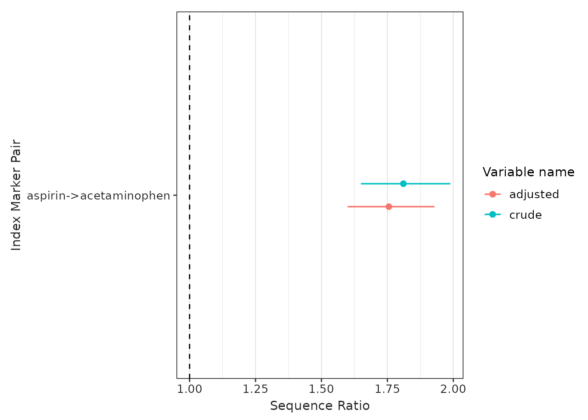
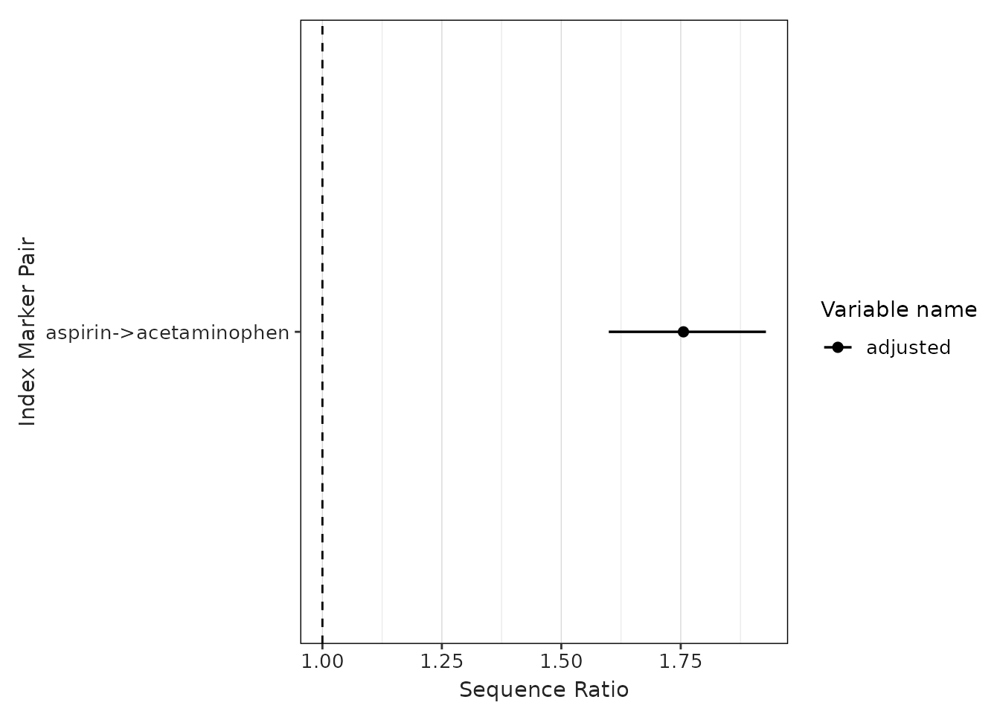
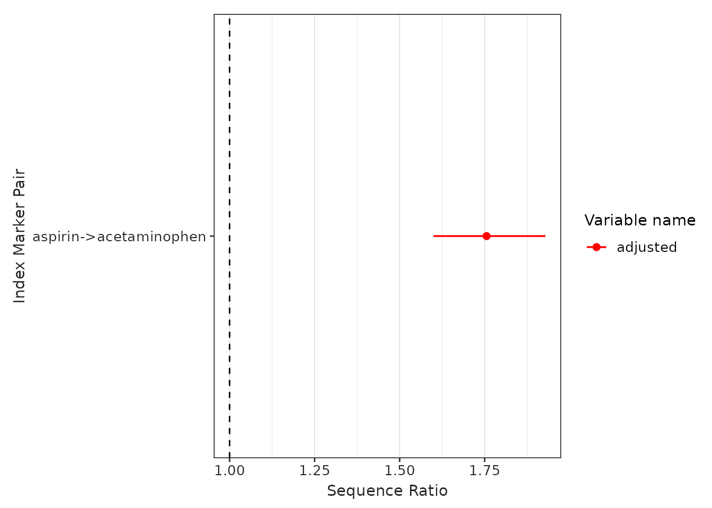

# Step 3. Visualise the sequence ratios

## Introduction

In this vignette we will explore the functionality and arguments of a
set of functions that will help us to understand and visualise the
sequence ratio results. In particular, we will delve into the following
functions:

- [`tableSequenceRatios()`](https://ohdsi.github.io/CohortSymmetry/reference/tableSequenceRatios.md):
  to generate a table summarising the results.
- [`plotSequenceRatios()`](https://ohdsi.github.io/CohortSymmetry/reference/plotSequenceRatios.md):
  to plot the sequence ratios.

This function builds-up on previous functions, such as
[`generateSequenceCohortSet()`](https://ohdsi.github.io/CohortSymmetry/reference/generateSequenceCohortSet.md)
and
[`summariseSequenceRatios()`](https://ohdsi.github.io/CohortSymmetry/reference/summariseSequenceRatios.md)
function (explained in detail in previous vignettes: **Step 1. Generate
a sequence cohort** and **Step 2. Obtain the sequence ratios**
respectively). Hence, we will pick up the explanation from where we left
off in the previous vignette.

Recall we had the table **intersect** in the cdm reference and that the
results of sequence ratio could produced as follows (**Step 2. Obtain
the sequence ratios**):

``` r

result <- summariseSequenceRatios(cohort = cdm$intersect)
```

## Table output of the sequence ratio results

The function `tableSequenceRatios` inputs the result from
`summariseSequenceRatios`, the default outputs a gt table.

``` r

tableSequenceRatios(result = result)
```

### Modify `type`

Instead of a gt table, the user may also want to put the sequence ratio
results in a flex table format (the rest of the arguments that we saw
for a gt table also applies here):

``` r

tableSequenceRatios(result = result,
                    type = "flextable")
```

Or a tibble:

``` r

tableSequenceRatios(result = result,
                    type = "tibble")
```

## Plot output of the sequence ratio results

Similarly, we also have
[`plotSequenceRatios()`](https://ohdsi.github.io/CohortSymmetry/reference/plotSequenceRatios.md)
to visualise the results.

``` r

plotSequenceRatios(result = result)
```



By default, it plots both the adjusted sequence ratios (and its CIs) and
crude sequence ratios (and its CIs). One may wish to only plot adjusted
one like so (note since only adjusted is plotted, only one colour needs
to be specified):

### Modify `onlyASR` and `colours`

``` r

plotSequenceRatios(result = result,
                   onlyASR = T,
                   colours = "black")
```



One could change the colour like so:

``` r

plotSequenceRatios(result = result,
                   onlyASR = T,
                   colours = "red")
```



``` r

CDMConnector::cdmDisconnect(cdm = cdm)
```
