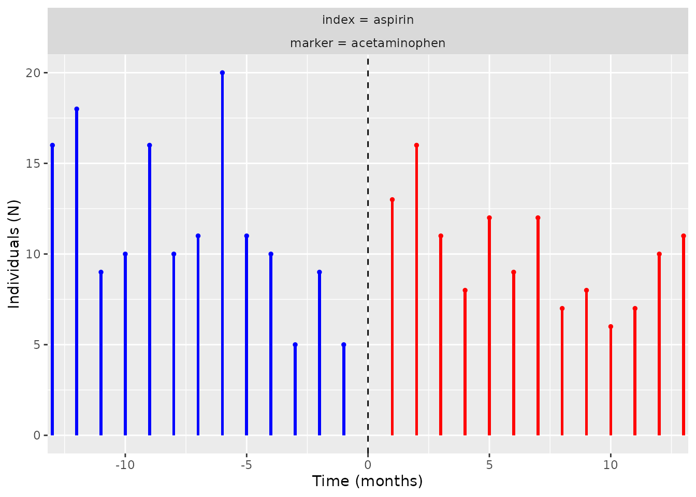

# Step 5: Visualise temporal symmetry

## Introduction

In this vignette we will explore the functionality and arguments of a
set of functions that will help us to understand and visualise the
temporal symmetry results (produced **Step 4: Obtain aggregated data on
temporal symmetry**). In particular, we will delve into the following
function:

- [`plotTemporalSymmetry()`](https://ohdsi.github.io/CohortSymmetry/reference/plotTemporalSymmetry.md):
  to plot the temporal symmetry.

This function builds-up on previous functions, such as
[`generateSequenceCohortSet()`](https://ohdsi.github.io/CohortSymmetry/reference/generateSequenceCohortSet.md)
and
[`summariseTemporalSymmetry()`](https://ohdsi.github.io/CohortSymmetry/reference/summariseTemporalSymmetry.md)
function.

Let’s regather the output from
[`summariseTemporalSymmetry()`](https://ohdsi.github.io/CohortSymmetry/reference/summariseTemporalSymmetry.md)

``` r

temporal_symmetry <- summariseTemporalSymmetry(cohort = cdm$intersect)
```

With this established, much like
[`summariseSequenceRatios()`](https://ohdsi.github.io/CohortSymmetry/reference/summariseSequenceRatios.md),
the object `temporal_symmetry` could then be fed into
[`tableTemporalSymmetry()`](https://ohdsi.github.io/CohortSymmetry/reference/tableTemporalSymmetry.md)
or
[`plotTemporalSymmetry()`](https://ohdsi.github.io/CohortSymmetry/reference/plotTemporalSymmetry.md)
to visualise the results:

``` r

tableTemporalSymmetry(result = temporal_symmetry)
```

``` r

plotTemporalSymmetry(result = temporal_symmetry)
```


Note that the $`x`$ axis is the time, which we recall to be the
initiation of the marker minus the initiation of the index. The unit of
the time difference here is month as this is the default from
`summarisTemporalSymmetry()`.

``` r

CDMConnector::cdmDisconnect(cdm = cdm)
```

**That would be the end of the vignette, have fun with the package!**
